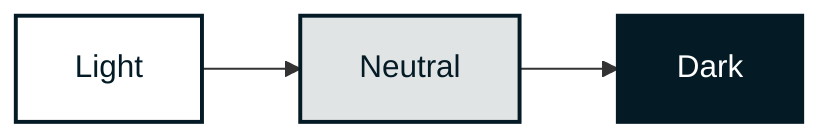
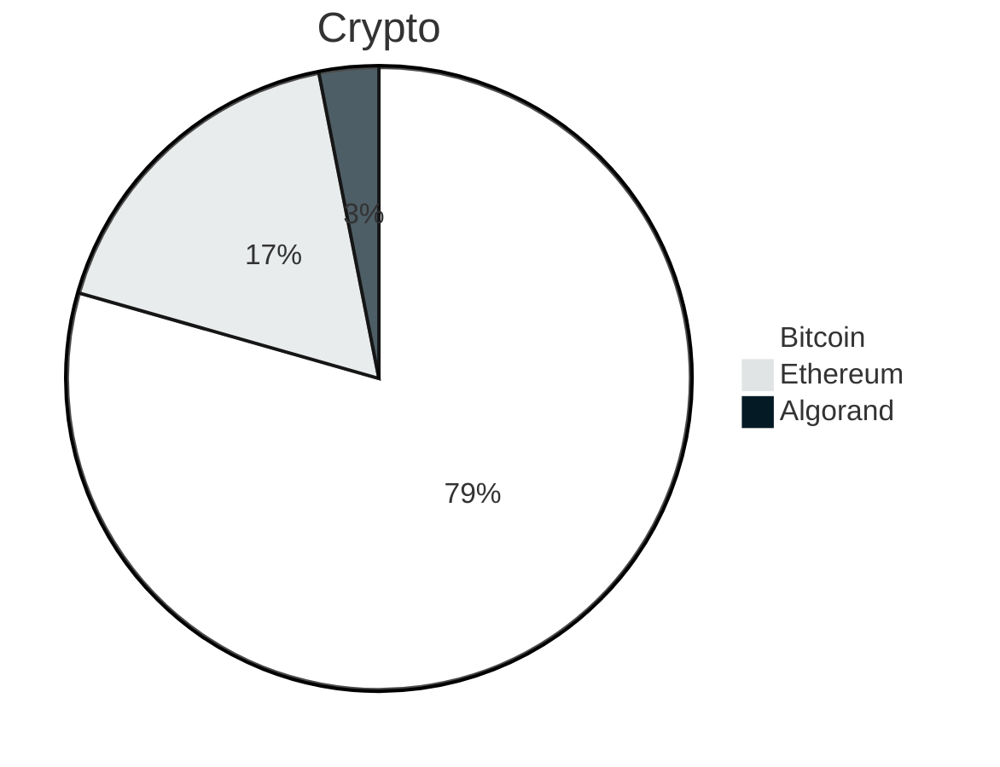

<div align="right">

[](https://github.com/stylescape/brand/blob/main/LICENSE)
[](https://vscode.dev/redirect?url=vscode://ms-vscode-remote.remote-containers/cloneInVolume?url=https://github.com/stylescape/brand)
[](https://stackblitz.com/github/stylescape/brand/tree/main?file=src%2Findex.html)

</div>

<p align="center">
    
</p>
<h1 align="center" style='border-bottom: none;'>Stylescape</h1>
<h3 align="center">Brand Assets & Visual Identity Guide</h3>

---


### Contents

- [Logo](#logo)
- [Typography](#typography)
- [Color](#color)
- [Graphics](#graphics)
- [Diagrams](#diagrams)
- [Elements](#elements)
- [Colophon](#colophon)

<br clear="both"/>

---

<div align="right">

[](https://github.com/stylescape/brand/issues/new?assignees=&labels=Needs%3A+Triage+%3Amag%3A%2Ctype%3Abug-suspected&projects=&template=bug_report.yml)
[](https://github.com/stylescape/brand/issues/new?assignees=&labels=Needs%3A+Triage+%3Amag%3A%2Ctype%3Abug-suspected&projects=&template=feature_request.yml)
[](https://github.com/stylescape/brand/issues/new?assignees=&labels=Needs%3A+Triage+%3Amag%3A%2Ctype%3Abug-suspected&projects=&template=question.yml)
[](https://github.com/stylescape/brand/issues/new?assignees=&labels=Needs%3A+Triage+%3Amag%3A%2Ctype%3Abug-suspected&projects=&template=suggestion.yml)
[](https://github.com/stylescape/brand/issues/new?assignees=&labels=Needs%3A+Triage+%3Amag%3A%2Ctype%3Abug-suspected&projects=&template=discussion.yml)

</div>

**Welcome to the official Brand Repository of Stylescape**

## Introduction

This repository is an all-inclusive resource of our brand identity, encapsulating our ethos, vision, and the graphical elements that distinguish us in the global arena of architectural innovation.

## Logo

[(Back to top)](#stylescape)

### Logomark

| Variant     | PNG   | SVG   | WEBP  | JPG   |
| :---------- | ----- | ----- | ----- | ----- |
| **dark** | [](https://github.com/stylescape/brand/blob/master/src/logo/logo_dark.png) | [](https://github.com/stylescape/brand/blob/master/src/logo/logo_dark.svg) | [](https://github.com/stylescape/brand/blob/master/src/logo/logo_dark.webp) | [](https://github.com/stylescape/brand/blob/master/src/logo/logo_dark.jpg) |
| **dark transparant** | [](https://github.com/stylescape/brand/blob/master/src/logo/logo_dark-trans.png) | [](https://github.com/stylescape/brand/blob/master/src/logo/logo_dark-trans.svg) | [](https://github.com/stylescape/brand/blob/master/src/logo/logo_dark-trans.webp) |   |
| **gray** | [](https://github.com/stylescape/brand/blob/master/src/logo/logo_gray.png) | [](https://github.com/stylescape/brand/blob/master/src/logo/logo_gray.svg) | [](https://github.com/stylescape/brand/blob/master/src/logo/logo_gray.webp) | [](https://github.com/stylescape/brand/blob/master/src/logo/logo_gray.jpg) |
| **gray transparant** | [](https://github.com/stylescape/brand/blob/master/src/logo/logo_gray-trans.png) | [](https://github.com/stylescape/brand/blob/master/src/logo/logo_gray-trans.svg) | [](https://github.com/stylescape/brand/blob/master/src/logo/logo_gray-trans.webp) | [](https://github.com/stylescape/brand/blob/master/src/logo/logo_gray-trans.jpg) |
| **light** | [](https://github.com/stylescape/brand/blob/master/src/logo/logo_light.png) | [](https://github.com/stylescape/brand/blob/master/src/logo/logo_light.svg) | [](https://github.com/stylescape/brand/blob/master/src/logo/logo_light.webp) | [](https://github.com/stylescape/brand/blob/master/src/logo/logo_light.jpg) |
| **light transparant** | [](https://github.com/stylescape/brand/blob/master/src/logo/logo_light-trans.png) | [](https://github.com/stylescape/brand/blob/master/src/logo/logo_light-trans.svg) | [](https://github.com/stylescape/brand/blob/master/src/logo/logo_light-trans.webp) |   |

### Logotype

`Will be provided shortly.`

<!-- |   |   |
| - | - |
|   |   | -->

### Favicon


### Badge

Share that your organisation or project endorses Stylescape by adding our badge to your readme or website.

`Will be provided shortly.`

<!-- ``` html
<a href="https://github.com/storybooks/storybook" target="_blank"></a>
``` -->

## Typography

### Main Display Font

We us `Barlow`.

<p align="center">
    
</p>

- Creators: [Jeremy Tribby](https://github.com/jpt) (Principal Design) and [Nguyễn Hồng Nhung](https://github.com/crystaltype) (Vietnamese)
- Repository: [jpt/barlow](https://github.com/jpt/barlow)
- License: [OFL](https://github.com/jpt/barlow/blob/main/OFL.txt)
- GIF courtesy of the original creators.

### Secondary Font

`Will be provided shortly.`

### Text Conventions

#### Brand Name

Capitalize the first "S" in "Stylescape" in all copy text. Stylescape should only be presented in all uppercase when displayed in our official logos; e.g.: "STYLESCAPE". In code, "stylescape" is all lowercase / snakecase.

- ✓ STYLESCAPE `(in Logo)`
- ✓ Stylescape `(in Text)`
- ✓ stylescape `(in Code)`
- × StyleScape
- × stylescape
- × Style-scape
- × Style scape
- × Style Acape

#### Headers

All headers are written in Title Case.

## Color

### Base Colors

|           | Color     | HEX       | RGB       | HSL       | HSB       | CMYK      |
| --------- | --------- | --------- | --------- | --------- | --------- | --------- |
|  | **Base 01** | `#041B26` | `4, 27, 38` | `199, 81%, 8%` | `200, 90, 15` | `13%, 4%, 0%, 85%` |
|  | **Base 02** | `#E1E4E5` | `225, 228, 229` | `195, 7%, 89%` | `200, 2, 90` | `2%, 0%, 0%, 10%` |
|  | **Base 03** | `#F0F1F2` | `240, 241, 242` | `210, 7%, 95%` | `200, 1, 95` | `1%, 0%, 0%, 5%` |
|  | **Base 04** | `#FFFFFF` | `255, 255, 255` | `0, 0%, 100%` | `0, 0, 0` | `0%, 0%, 0%, 0%` |


### Secondary Colors

`Will be provided shortly.`

## Graphics

### Artworks

Our repositories use the following artworks to make them just a little bit moe enticing!

| Color | Monochrome | Acccent |
| ----- | ---------- | ------- |
| [](https://github.com/stylescape/brand/master/src/image/repository_cover/block_foundation-structure-03-color.jpg)*`structure-03-color`* | [](https://github.com/stylescape/brand/master/src/image/repository_cover/block_foundation-structure-03-mono.jpg)*`structure-03-mono`* | [](https://github.com/stylescape/brand/master/src/image/repository_cover/block_foundation-structure-03-accent.jpg)*`structure-03-accent`* |

## Diagrams

We use [Mermaid](https://mermaid.js.org/) in our repositories for simple data and process visualisations. Some examples:

### Flowchart



`class_light`

``` md
classDef class_light fill:#FFFFFF,color:#041B26,stroke:#041B26,stroke-width:2px;
```

`class_neutral`

``` md
classDef class_neutral fill:#E1E4E5,color:#041B26,stroke:#041B26,stroke-width:2px;
```

`class_dark`

``` md
classDef class_dark fill:#041B26,color:#FFFFFF,stroke:#041B26,stroke-width:2px;
```

### Pie chart



``` md
%%{init: {"theme": "base", "pie": {"textPosition": 0.5}, "themeVariables": { "pieOuterStrokeWidth": "2px", "pie1": "#FFFFFF", "pie2": "#E1E4E5", "pie3": "#041B26"}}}%%
```

## Elements

### Icons

Within our repositories we use simple-icons for most iconographic purposes. This brand repository includes a copy this icon set (downloaded per 2023-07-25): [/src/icons/simple-icons/](/src/icons/simple-icons/)

- simple-icons website: [simpleicons.org](https://simpleicons.org/)
- simple-icons reposiory: [github.com/simple-icons/simple-icons](https://github.com/simple-icons/simple-icons)
- simple-icons license: [CC0 1.0 Universal](https://github.com/simple-icons/simple-icons/blob/develop/LICENSE.md)

### IO Shields

We use [IO Shields](https://shields.io/) combined with [simple-icons](https://simpleicons.org/) to display repository information.

#### Parameters

| Field           | Value           | Description |
| :-------------- | :-------------- | :---------- |
| style           | `flat-square`    |             |
| logo            | `bitcoin`       | Named logo via [simple-icons](https://simpleicons.org/) |
| logoColor       | `#FFFFFF`       | All white logo to match the text color |
| label           | `License:`      | Title caps label text |
| labelColor      | `#041B26`       | Completely dark background   |
| color           | `#041B26`       |  |
| cacheSeconds    | default         |  |
| link            | misc.           | Always try to provide a link |

#### Shields

|                       |       | shield.io url   | simpleicons tag   |
| :-------------------- | :---- | :---- | :---- |
| **License**           | [](https://github.com/stylescape/brand/blob/main/LICENSE) | [/badges/git-hub](https://shields.io/badges/git-hub) | `readthedocs` |
| **Docker Pulls**      | [](https://hub.docker.com/r/blockfoundation/ethereum-client) | `docker` |
| **Docker Stars**      | [](https://hub.docker.com/r/blockfoundation/ethereum-client) | [/badges/docker-stars](https://shields.io/badges/docker-stars) | `docker` |
| **Docker Version**    | [](https://hub.docker.com/r/blockfoundation/ethereum-client/tags) | [/badges/docker-stars](https://shields.io/badges/docker-stars) | `docker` |
| **Docker Size**       | [](https://hub.docker.com/r/blockfoundation/ethereum-client) | [/badges/docker-image-size-tag](https://shields.io/badges/docker-image-size-tag) | `docker` |
| **devContainer**      | [](https://vscode.dev/redirect?url=vscode://ms-vscode-remote.remote-containers/cloneInVolume?url=https://github.com/stylescape/brand) | [/badges](https://shields.io/badges) | `visualstudiocode` |
| **DOI**               | [](https://doi.org/10.5281/zenodo.8173471) | [/badges](https://shields.io/badges) | `DOI` |
| **Zotero**            | [](https://www.zotero.org/groups/block) | [/badges](https://shields.io/badges) | `Zotero` |
| **Download**          |  | [/badges](https://shields.io/badges) | `files` |

#### Repository Headers

All repositories include the basic header, in some cases combined with additional shields.

##### Basic Repository Header

<div align="right">

[](https://github.com/stylescape/brand/blob/main/LICENSE)
[](https://vscode.dev/redirect?url=vscode://ms-vscode-remote.remote-containers/cloneInVolume?url=https://github.com/stylescape/brand)

</div>

##### Basic Repository Interactions

<div align="right">

[](https://github.com/stylescape/brand/issues/new?assignees=&labels=Needs%3A+Triage+%3Amag%3A%2Ctype%3Abug-suspected&projects=&template=bug_report.yml)
[](https://github.com/stylescape/brand/issues/new?assignees=&labels=Needs%3A+Triage+%3Amag%3A%2Ctype%3Abug-suspected&projects=&template=feature_request.yml)
[](https://github.com/stylescape/brand/issues/new?assignees=&labels=Needs%3A+Triage+%3Amag%3A%2Ctype%3Abug-suspected&projects=&template=question.yml)
[](https://github.com/stylescape/brand/issues/new?assignees=&labels=Needs%3A+Triage+%3Amag%3A%2Ctype%3Abug-suspected&projects=&template=suggestion.yml)
[](https://github.com/stylescape/brand/issues/new?assignees=&labels=Needs%3A+Triage+%3Amag%3A%2Ctype%3Abug-suspected&projects=&template=discussion.yml)

</div>

##### Docker Container Repository Header

<div align="right">

[](https://github.com/stylescape/brand/blob/main/LICENSE)
[](https://vscode.dev/redirect?url=vscode://ms-vscode-remote.remote-containers/cloneInVolume?url=https://github.com/stylescape/brand)
[](https://hub.docker.com/r/blockfoundation/ethereum-client)
[](https://hub.docker.com/r/blockfoundation/ethereum-client)
[](https://hub.docker.com/r/blockfoundation/ethereum-client/tags)
[](https://hub.docker.com/r/blockfoundation/ethereum-client)

</div>

##### TypeScript / NPM Repository Header

<div align="right">

[](https://github.com/stylescape/brand/blob/main/LICENSE)
[](https://vscode.dev/redirect?url=vscode://ms-vscode-remote.remote-containers/cloneInVolume?url=https://github.com/stylescape/brand)

</div>

##### Python / PyPi Repository Header

<div align="right">

[](https://github.com/stylescape/brand/blob/main/LICENSE)
[](https://vscode.dev/redirect?url=vscode://ms-vscode-remote.remote-containers/cloneInVolume?url=https://github.com/stylescape/brand)

</div>

---
